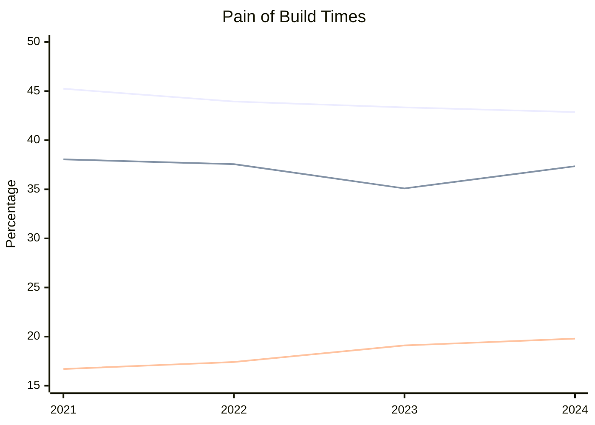
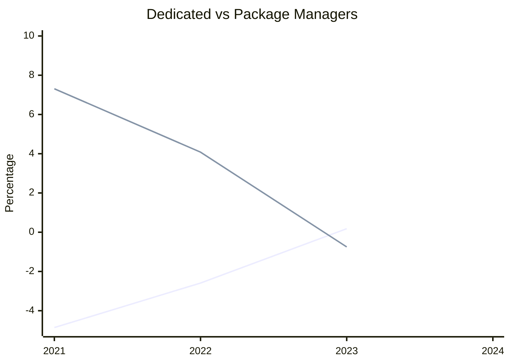
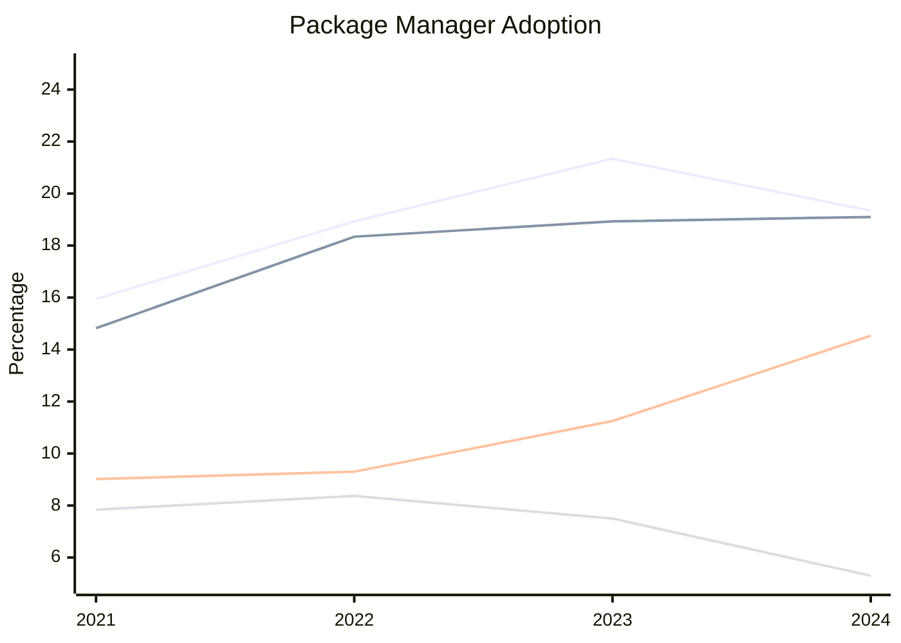
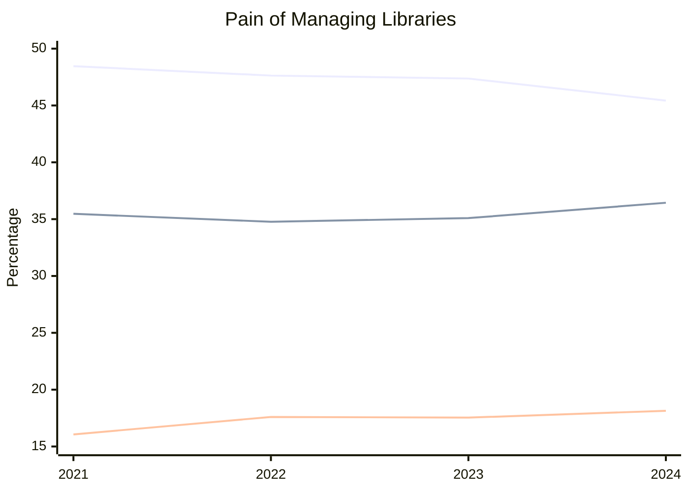
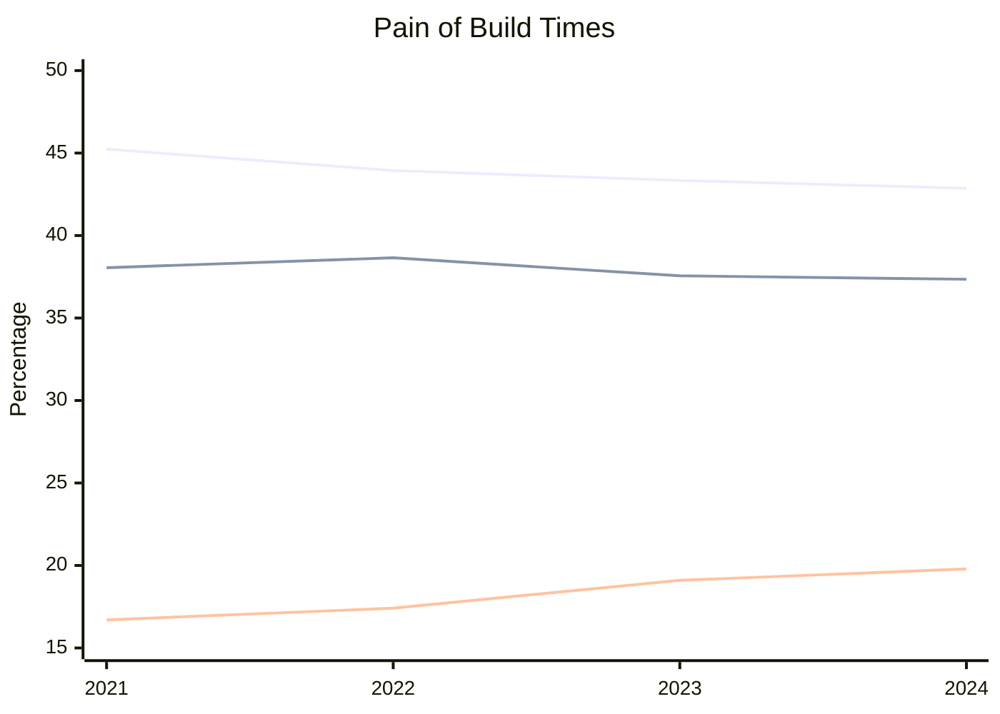
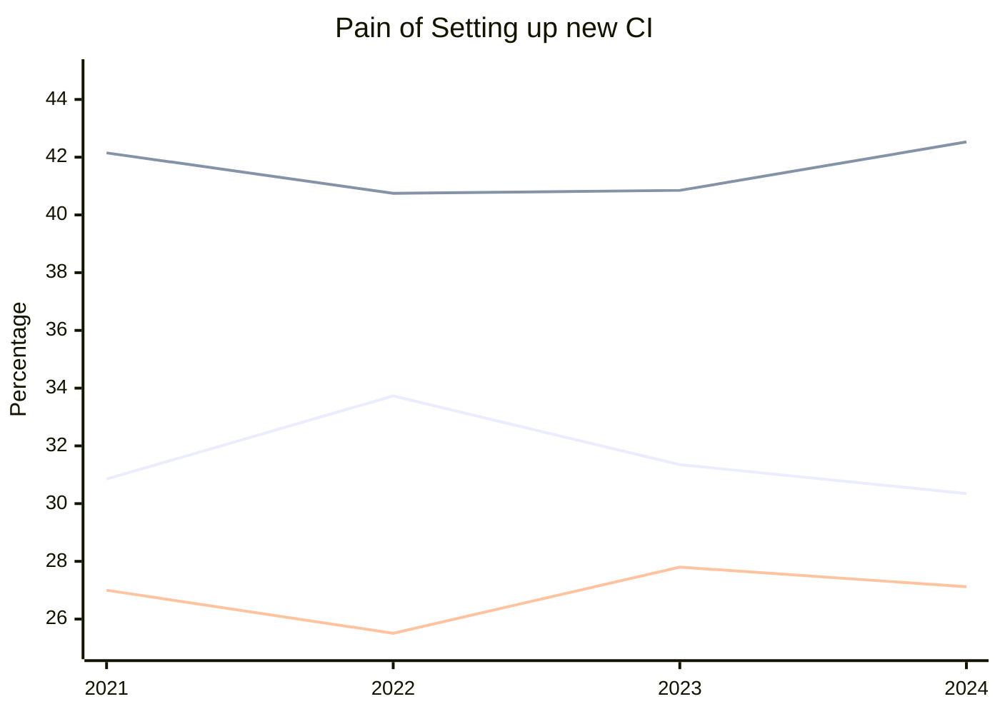
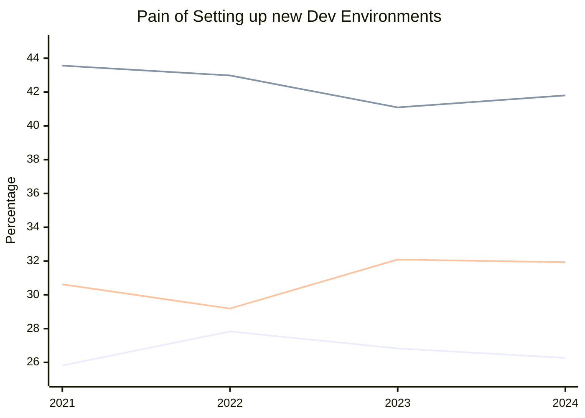

It's that time of year once again! The ISO Committee published the summary of the results for the [_C++ Developer Survey "Lite"_](https://isocpp.org/blog/2024/04/2024-annual-cpp-developer-survey-lite). This has been [running for several years](https://isocpp.org/blog/2021/04/2021-annual-cpp-developer-survey-lite) and it's probably the first time we can start to see some trends... hopefully!

The survey results, with less than 1300 developers compared to 1700 last year, is only partially explained by [third-party restrictions](https://help.surveymonkey.com/en/surveymonkey/policy/export-control-policy/) as noted by the [blog post sharing the results](https://isocpp.org/blog/2024/04/results-summary-2024-annual-cpp-developer-survey-lite). Regardless a wider sample would be ideal. The dominance of CMake with an 83% market share is striking. Could this 4% growth be linked to the lower burden for managing build scripts? Despite these limitations, the survey offers valuable insights into C++ ecosystem trends.

Since this blog is all about building and shipping C++ software, I'll be focusing on the tooling and ecosystem questions and results.  There's a natural bias here, as I'm particularly interested in how these trends affect developers like us. But fear not, there's plenty for everyone!  In fact, I'm curious what aspects other bloggers will delve into.  Let's jump right in as there are some fascinating statistical correlations to explore!

<!--truncate-->

## Overall Impression

There are positive signs! Build times, a crucial metric for build pipeline efficiency, are improving. The distribution of pain levels is also shifting downward. "Major Pain" responses have decreased to 43%, while "Minor Pain" holds steady at 37%.  "Not Significant" responses are on the rise, reaching nearly 20%.

:::note

For enhanced clarity, I've opted to present the rest of the data in a table format in addition to the graphs. While the official diagram plugin, Mermaid-JS, doesn't currently support legends for this specific chart type (see issue [mermaid#5292](https://github.com/mermaid-js/mermaid/issues/5292)); the tables allow for a clear connection between the data points and their corresponding lines.

:::

## Key Highlights

Here's a summary of the 2024 Annual C++ Developer Survey "Lite":

### Who are the respondents?

* Almost all respondents (91%) use C++ at work.
* Over two-thirds (67%) use C++ for personal projects or hobbies.
* The majority of respondents (52%) have 6-20 years of experience in C++.
* Even more (64%) have 6-20 years of total programming experience (including languages other than C++).

### What platforms and build tools do C++ developers use?

* CMake is the dominant build tool, used by over 80% of respondents.
* Ninja (45%) has a well establish place.
* Windows (desktop and server) is the most popular target platform, with over 60% of respondents developing for it.
  * Make/nmake (36%) are also popular choices.
  * MSBuild is commonly used for Windows development (30%).
* Linux (desktop and server) is also very common (over 50%).
* Nearly a third (32%) develop for embedded systems.
  * The most common project type was embedded systems (33%)
* Mobile development is less common (Android: 15%, iOS: 10%) but still used by a significant number of respondents.

While the survey results provide valuable insights, access to the raw data would allow for a more granular analysis. This would enable us to answer intriguing questions like:

* What percentage of developers targeting Windows, Linux, and macOS?
* Is there a significant overlap between developers building for Android and iOS?
* How does Ninja usage vary across different operating systems and target platforms?

With additional data, we could delve deeper into the trends and potentially uncover hidden correlations.

### How is the cloud used in C++ development?

* The most common cloud use cases are CI/CD (continuous integration and continuous delivery) and testing (around 53% and 29% respectively).
* Cloud storage and deployment are also used by a significant portion of respondents (around 26% and 22% respectively).

It appears there may be a discrepancy in the choices for this question. Since CI/CD encompasses building, testing, _and_ deploying code, the combined total of these individual options should ideally exceed the percentage of respondents who use CI/CD. For future surveys, ensuring clear and comprehensive answer choices would improve the interpretability of the results.

### Do C++ projects use sanitizers and fuzzing?

* Nearly half (49%) of projects use sanitizers or fuzzing as part of their development process.
* However, a significant portion (45%) do not use them.

Given the amount of focus on memory safety, as the 5 dedicated "pain" questions to it would suggest, and how [these techniques improve security](https://medium.com/mit-security-seminar/beyond-sanitizers-guided-fuzzing-and-security-hardening-9cc8155e19fb). It  might be a surprise to learn these number have not see any significant movement. It seems to suggest the burden of upgrading CI/CD pipelines might be inhibiting the progress in adopting these tools.

### What major recent features do you planning on adoption this year?

* Among the three features surveyed (Concepts, Coroutines, and Modules), Modules have the lowest planned adoption rate, only 29.25% of respondents indicated their projects would allow module usage.

As the article [C++20 modules and Boost: an analysis](https://anarthal.github.io/cppblog/modules) highlights, concerns exist around managing the potential increase in complexity for build systems. This is likely in addition to modules introducing interoperability challenges between build systems and package managers - a concern that many of respondents are likely to have as usage of multiple build systems was very high - might delay the adoption process until broader tooling support matures.

### What other programming languages do C++ developers use?

* Python (73%) and C (53%) are the most popular companions to C++.
* JavaScript (27%), C# (24%), and Rust (18%) are also commonly used.

The survey results reveal a fascinating interplay between C++ and other programming languages. Python's dominance (73%) as a companion language likely stems from its versatility in scripting, data analysis, and build orchestration tasks, particularly for developers supporting multiple platforms (a common scenario based on the survey). Where JavaScript (27%) and C# (24%) likely play a significant role due to their [platform specific integrations](https://learn.microsoft.com/en-us/archive/msdn-magazine/2012/november/javascript-building-and-using-controls-in-windows-store-apps-with-javascript) which resonates well with the high usage of Windows (over 60%). Meanwhile, the rise of Rust (18%) aligns with the growing emphasis on memory safety in C++ development.

## Dependency Management

> How do you manage your C++ 1st and 3rd party libraries?

Year | 1. Inlined | 2. Dedicated | 3. System Manager | 4. Download | 5. Conan | 6. vcpkg | 7. other | 8. nuget | 9. None
--- | --- | --- | --- | --- | --- | --- | --- | --- | ---
2021 | 68.96% 1,284 | 55.75% 1,038 | 37.49% 698 | 32.28% 601 | 15.95% 297 | 14.82% 276 | 9.02% 168 | 7.84% 146 | 1.66% 31
2022 | 69.91% 827 | 50.89% 602 | 38.80% 459 | 27.56% 326 | 18.93% 224 | 18.34% 217 | 9.30% 110 | 8.37% 99 | 1.35% 16
2023 | 68.11% 1,162 | 48.30% 824 | 36.23% 618 | 27.43% 468 | 21.34% 364 | 18.93% 323 | 11.25% 192 | 7.50% 128 | 1.41% 24
2024 | 68.54% 854 | 48.48% 604 | 37.80% 471 | 25.60% 319 | 19.34% 241 | 19.10% 238 | 14.53% 181 | 5.30% 66 | 1.69% 21

1. The library source code is part of my build
2. I compile the libraries separately using their instructions
3. System package managers (e.g., apt, brew, …)
4. I download prebuilt libraries from the Internet
5. Conan
6. Vcpkg
7. Other (please specify)
8. Nuget
9. None of the above, I do not have any dependencies

### Dedicated Build Instructions are being Replaced by Package managers

Taking the sum of usage of Conan, Vcpkg, Other, and Nugest (disclaimer: "other" is assumed to be another package manager but there's no data about what people wrote) and calculating the delta over the previous year.
Calculating the [Pearson's Product Moment Correlation Coefficient](https://www.ncl.ac.uk/webtemplate/ask-assets/external/maths-resources/statistics/regression-and-correlation/strength-of-correlation.html). Give `r = -0.9983817302` where "−0.8 > r > −1" is Strong negative linear correlation. Nearly perfect.

This is the best evidence for the entry point to using a package manager is handling dependencies with their own unique workflow and pipelines. Eliminating those extra processes can certainly reduce the pain of managing build system complexity.

Year | Dedicated | Package Managers
--- | --- | ---
2022 | -4.86% | 7.31%
2023 | -2.59% | 4.08%
2024 | 0.18% | -0.75%

Comparing other categories against Package Managers and System Package Managers did not result in any significant correlations which exception to slight connection with downloads getting replace by package managers.

### Package Manager Preferences

It is encouraging to see Nuget, which is for .NET and C# losing ground. The data for _"other"_ will hopefully inspire a revised list of choices next year. This would make up and coming package managers more appealing by helping to promote and attract users. This would be an excellent driver for more innovation in this space.

## Pain Points

There's is thankfully a large focus on improving the tooling and "evolving the ecosystem", to steal the lingo, so let's dive in.

:::note

The colors are Major Pain, Minor Pain, Not Significant Pain for the follow graphs.

:::

### Managing libraries my application depends on

Positive signs for supporting external dependencies! The percentage of developers reporting this topic as a major pain point has steadily decreased, with a 3% decline from 2021 to 2024. This is accompanied by a corresponding increase in those reporting it as a minor pain or not significant at all.

Year | Major Pain | Minor Pain | Not Significant
--- | --- | --- | ---
2021 | 48.46% 899 | 35.47% 658 | 16.06% 298
2022 | 47.63% 563 | 34.77% 411 | 17.60% 208
2023 | 47.37% 810 | 35.09% 600 | 17.54% 300
2024 | 45.43% 571 | 36.44% 458 | 18.14% 228

#### Delta Change

With the previous year

Year | Major Pain | Minor Pain | Not Significant
--- | --- | --- | ---
2022 | -0.83% | -0.70% | 1.54%
2023 | -0.26% | 0.32% | -0.06%
2024 | -1.94% | 1.35% | 0.60%

### Build times

**Encouraging signs for build times!** So much so, it's included twice. Over the past four years, the survey data reveals a consistent downward trend in the percentage of developers reporting long build times as a major pain point. This decrease of 2.38% from 2021 to 2024 suggests that the C++ build ecosystem is becoming more efficient. There's a still a very slim number of developer who are not burdened by long times times.

Further exploration could investigate:

* Is there any correlation with the decrease in pain managing dependencies?
* Are there correlations between specific build tools and perceived build times?
* How do build times vary across different project types or target platforms?

Year | Major Pain | Minor Pain | Not Significant
--- | --- | --- | ---
2021 | 45.24% 837 | 38.05% 704 | 16.70% 309
2022 | 43.94% 515 | 38.65% 453 | 17.41% 204
2023 | 43.34% 735 | 37.56% 637 | 19.10% 324
2024 | 42.86% 537 | 37.35% 468 | 19.79% 248

### Setting up a continuous integration pipeline from scratch

The survey results indicate a persistent challenge. While there's a slight decrease in the percentage of developers reporting it as a major pain point (down to 1% from 2023 to 2024), it remains a significant hurdle for many (nearly a third of respondents!). There's little to no improvement over the 2021 data.

Is there a light at the end of the tunnel?

Perhaps! The data does shows a downward trend in those reporting it as a minor pain, suggesting some improvement. Additionally, the "Not Significant" category remains relatively stable. This could indicate that for certain segment of the ecosystem, setting up CI pipelines is becoming a more manageable task.

Year | Major Pain | Minor Pain | Not Significant
--- | --- | --- | ---
2021 | 30.85% 568 | 42.15% 776 | 27.00% 497
2022 | 33.73% 394 | 40.75% 476 | 25.51% 298
2023 | 31.35% 531 | 40.85% 692 | 27.80% 471
2024 | 30.35% 376 | 42.53% 527 | 27.12% 336

### Setting up a development environment from scratch

The data on setting up development environments reveals a fascinating trend. While there's a positive shift with more respondents finding it a "not significant" pain point (up to 31.93% in 2024), there's also a concerning slight increase in those reporting it as a major pain (26.27% in 2024).

One explanation could be advancements in techniques for build script. There are some very high quality sources for CMake. That category saw a in the number of respondents experiencing pain that. However, the challenge of setting up the entire environment, especially for complex systems, seems to be persisting.

Year | Major Pain | Minor Pain | Not Significant
--- | --- | --- | ---
2021 | 25.82% 479 | 43.56% 808 | 30.62% 568
2022 | 27.83% 329 | 42.98% 508| 29.19% 345
2023 | 26.83% 459 | 41.09% 703 | 32.09% 549
2024 | 26.27% 330 | 41.80% 525 | 31.93% 401

## Closing Remarks

Get subscribed or make sure to follow. I will absolutely be continuing to post about these topics. There is 15-25% range of developers that have figured out how to build, test and ship this code with a not significant amount fo pain, and the goal is to get you there as well.

There an interesting pessimism that was present in 2022, maybe a global health pandemic and financial uncertainty impacted how respondents felt? It does make the current data trend well.
