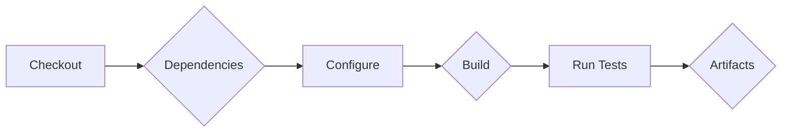
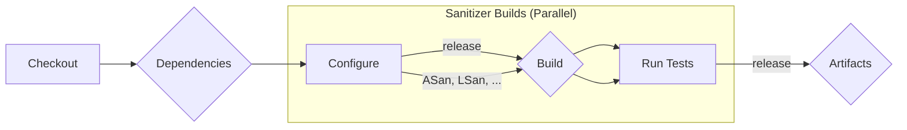
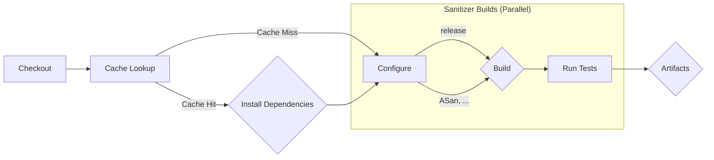

# Boosting C++ Memory Safety with Parallel Builds and Shared Configurations

C++ grants developers immense power, but with it comes the [greater responsibility of managing memory](https://thenewstack.io/out-with-c-and-c-in-with-memory-safety/). Memory leaks and access violations can bring down even the most robust applications. To combat these issues, [sanitizers](https://en.wikipedia.org/wiki/Code_sanitizer) like AddressSanitizer (ASan) and LeakSanitizer (LSan) are [invaluable tools](https://blog.trailofbits.com/2024/05/16/understanding-addresssanitizer-better-memory-safety-for-your-code/#:~:text=ASan%20inserts%20checks%20around%20memory,compared%20to%20other%20similar%20tools.). When it comes to addressing security, this is [only the tip of the iceberg](https://herbsutter.com/2024/03/11/safety-in-context/); you are expected to do more but sanitizers are an approachable starting pointing.

Despite these obvious upsides [50% of developers don't leverage these tools](/2024-survey-results), integrating them into the build process often raises concerns about increased build times. This blog post explores a strategy to leverage modern build tools and parallelization to achieve exceptional memory safety without sacrificing CI speed.

## The Power of Many: Building More Configurations

Traditionally, projects might ship with a single build configuration optimized for production - they are built exclusive for the platforms they support. But what if we [built more configurations](/build-more-configurations) specifically designed for memory safety checks? We can introduce configurations that enable sanitizers like ASan and LSan during the build process. These configurations would catch memory issues early on, preventing them from reaching production.

:::info Tip

This also possible [cross-platform](https://learn.microsoft.com/en-us/cpp/sanitizers/asan-continue-on-error?view=msvc-170), thought it might be more effective to target just one depending on your infrastructure.

:::

## Foundation: Simple CI Pipeline

As previously covered, CMake Preset are an excellent way to [organize build configurations](/simple-ci-with-presets). If you are unsure about them, checkout [the old school way](https://www.reddit.com/r/cpp/comments/lmj32h/integrating_sanitizers_into_your_ci_workflow/) or this [far more restrictive implementation](https://ngathanasiou.wordpress.com/2022/07/04/sanitizers-in-continuous-integration/), there's an elegance to the simplicity presets can bring. Let's take the release preset and wrap that in a pipeline to get started.

**Pre-conditions:**

* **Compiler Toolchain:** The CI environment should have the necessary compiler toolchain (e.g., GCC, Clang) pre-installed.
* **Dependencies:** Any project dependencies should be readily available through package managers or pre-downloaded artifacts.
* **Test Coverage:** Good test coverage either through unit or integration tests where the code can be exercised; working examples are a good substitute.

**Pipeline Stages:**



1. **Checkout:** Fetch the latest code from the version control system (e.g., Git).
2. **Install Dependencies:** If dependencies aren't pre-installed, use package managers to install them during this stage.
3. **Configure:**
   * Select the desired build configurations using CMake. For example one for production and one for each sanitizer (ASan, LSan, etc.).
4. **Build:**
   * Execute the build commands defined in the CMake configurations from stage 3.
5. **Test:**
   * Run unit tests and other automated tests for each successfully built configuration.
6. **Artifacts:**
   * Archive and store build artifacts like executables and test reports for further analysis or future reference.

Check the [examples for GitHub Actions](/simple-ci-with-presets#refactoring-ci-pipelines) from the presets post putting these principals practice.

## The Key: Parallel Builds for Speed

The challenge? Building with multiple sanitizers can significantly [impact build times](https://github.com/google/sanitizers/wiki/AddressSanitizerPerformanceNumbers) especially if they are already problematic. Here's where the magic of **parallel builds** comes in. By leveraging tools like CMake, we can define separate build configurations for each sanitizer. More importantly, we can configure these builds to run [in parallel](https://about.gitlab.com/blog/2021/01/20/using-run-parallel-jobs/), a well established technique to reduce build times.



## Implementing this on GitHub Actions

```yaml
name: CI with Parallel Sanitizer Builds

on:
  push:
    branches: [ main ]

jobs:
  build:
    runs-on: ubuntu-latest # Make sure to have a proper version-controlled build image
    strategy:
      matrix:
        preset: [release, asan, lsan]
    steps:
      - uses: actions/checkout@v4

      - name: Install dependencies
        uses: ./.github/actions/install_deps # Setup caching and call favorite package manager

      - name: Configure with preset
        run: cmake --preset ${{ matrix.preset }}

      - name: Build
        run: cmake --build --preset ${{ matrix.preset }}

      - name: Run tests
        run: cmake --build --target unit_tests_run --preset ${{ matrix.preset }}

      - if: matrix.preset == 'release'
        name: Upload artifacts
        uses: actions/upload-artifacts@v4
        with:
          paths: build/release
```

## Caching Third-Party Dependencies for Effective Sanitizer Builds

When using sanitizers, it's crucial to ensure that the entire build graph, [including third-party dependencies](https://gaultier.github.io/blog/you_inherited_a_legacy_cpp_codebase_now_what.html#sanitizers), is built with sanitizers enabled. This guarantees that memory issues are detected across the entire codebase, not just within your own code, as the boundaries are were mistakes are most likely.

As we've established, building with sanitizers can significantly impact build times; to address this challenge, caching mechanisms play a vital role in optimizing the CI workflow. Third-party dependencies are less likely to change, but need to be [treated with the same care](https://softwareengineering.stackexchange.com/a/348772), between build are offer an effective return on investment for the effort to implement more complex workflows.

### Why Caching Matters

Caching third-party dependencies can [significantly improve build times](https://blog.gradle.org/introducing-gradle-build-cache#does-it-help) by avoiding redundant downloads and builds. This is particularly beneficial when using sanitizers, as the entire build graph needs to be re-evaluated with sanitizers enabled for each configuration.

Here's why caching is crucial:

* **Reduced Build Times:** Caching eliminates the need to repeatedly download and build dependencies, especially for frequently used libraries. This can drastically reduce build times, especially on CI pipelines.
* **Consistent Results:** Caching ensures that the same dependencies are used across different builds, leading to more consistent and reliable results.
* **Improved Developer Experience:** Faster builds translate to a smoother development experience for the team, allowing them to iterate and test code changes more efficiently.

### Strategies for Caching Third-Party Dependencies

Several strategies can be employed to effectively cache third-party dependencies when using sanitizers in C++ projects:

* **Per-Preset Caches:** Create separate caches for each build configuration (e.g., release, asan, lsan). This ensures that dependencies are only downloaded and built once for each configuration, reducing redundancy.
* **Conan Packages:** Utilize package managers like Conan to manage third-party dependencies. Conan allows for caching packages remote (and [locally](https://blog.conan.io/2023/11/28/Conan-new-features-2-0-14.html)) and reusing them across different builds.

Adding onto the pipeline example, this looks like the following:



## Putting it All Together

1. **Define Build Configurations:** Use CMake to create individual build configurations for each sanitizer and a standard production configuration.
2. **Enable Parallel Builds:** Leverage multiple cores or machines for parallel execution of these configurations.
3. **Implement Caching:**
    * Utilize per-preset caches and/or Conan packages to efficiently manage third-party dependencies, ensuring consistent results and faster builds.

## Benefits

* **Improved Memory Safety:** Sanitizers catch memory issues early on, preventing them from reaching production.
* **Fast CI Builds:** Parallel builds mitigate the impact of additional configurations on CI pipelines.
* **Consistent Development Workflow:** Shared CMake presets streamline the development process by providing a familiar environment with memory safety checks readily available.

By adopting this strategy, you can elevate your C++ project's memory safety without sacrificing development speed or introducing workflow friction. Remember, memory safety is not just a CI concern; it's an essential part of the entire development lifecycle. So, build more configurations, leverage parallelization, and empower your developers to write robust, memory-safe code!
